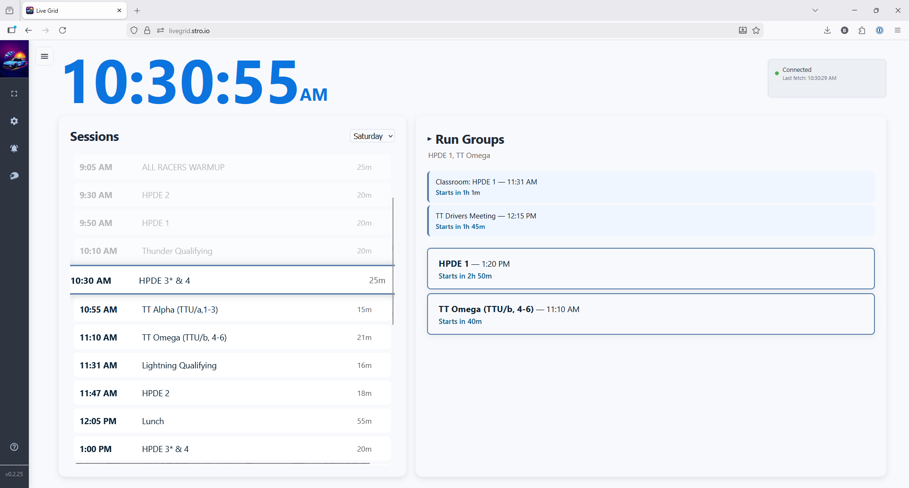

# LiveGrid

LiveGrid helps track-day and race participants follow the event schedule in real time. It makes it easier to see what is happening now, what is coming up next, and which sessions matter to your selected run groups.

It is designed to make paddock schedule-checking faster and less error-prone.

- Follow the current session with automatic highlighting
- Filter the schedule to your run groups
- See upcoming sessions and relevant meetings
- Sync preferences across devices when signed in
- Receive lock-screen notifications when enabled
- Switch between supported event schedules

<table align="center">
  <tr>
    <td align="center">
      
    </td>
  </tr>
</table>

# Using LiveGrid

Open [LiveGrid](https://livegrid.stro.io) in your browser.

## Install On Your Phone

LiveGrid can be safely installed like an app through your phone browser. You do not need to download it from the App Store or Google Play.

### iPhone or iPad

1. Open LiveGrid in Safari.
2. Tap the Share button.
3. Tap `Add to Home Screen`.
4. Tap `Add`.

After that, LiveGrid will appear on your home screen like an app.

### Android

1. Open LiveGrid in Chrome.
2. Tap the menu button in the top-right corner.
3. Tap `Install app` or `Add to Home screen`.
4. Confirm the install.

After that, LiveGrid will appear in your app list and on your home screen.

## Enable Notifications

LiveGrid can notify you before your sessions and important meetings, but a few things need to be set up first.

**What Is Required**

- Open LiveGrid on a device and browser that support notifications
- Install LiveGrid to your phone home screen when your device/browser expects that for app-style alerts
- Allow notification permission when your phone or browser asks
- Sign in to your LiveGrid account
- Select your run groups so LiveGrid knows which sessions are relevant to you

**Why An Account Is Needed**

An account is required so your notification settings belong to you instead of only to one browser tab or one single device.

That lets LiveGrid:

- remember your run groups and notification preferences
- know which notifications should be sent to you
- sync your preferences across multiple devices
- keep notification registration tied to your account when you sign in or out

Without an account, notifications would be much less reliable and much harder to keep in sync.

**How To Turn Notifications On**

1. Open LiveGrid on the device where you want alerts.
2. Sign in to your account.
3. Choose your run groups.
4. Enable notifications in the app.
5. Accept the notification permission request from your browser or phone.

After that, LiveGrid can alert you even when you are not actively looking at the schedule page.

## Event Organizers

If you organize events and want your schedule format supported, [email me](mailto:hello+livegrid@stro.io).

## Documentation

Technical setup, development, deployment, testing, architecture, and parser details live in [`docs/`](docs/).

- [Development Guide](docs/DEVELOPMENT.md)
- [Architecture](docs/ARCHITECTURE.md)
- [CI/CD](docs/CICD.md)
- [Testing](docs/TESTING.md)
- [Parsers](docs/PARSERS.md)
- [API Reference](docs/API.md)
- [Logging](docs/LOGGING.md)

## Support

- Issues: [GitHub Issues](https://github.com/brandonstrohmeyer/livegrid/issues)

## License

This project is licensed under the GNU General Public License v3.0. See [LICENSE](LICENSE) for details.
